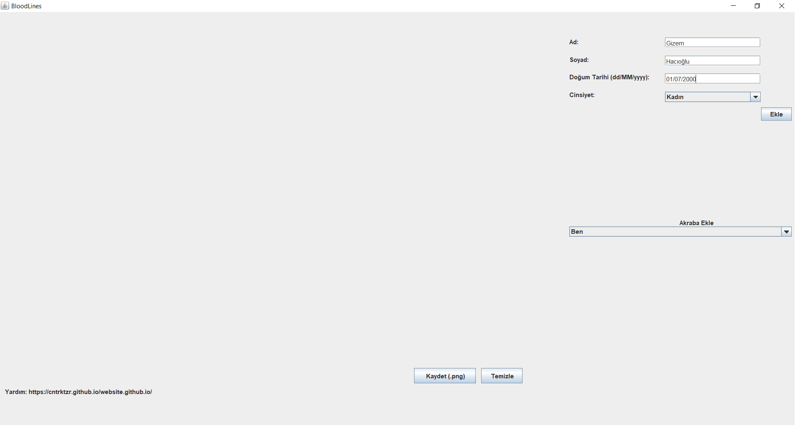
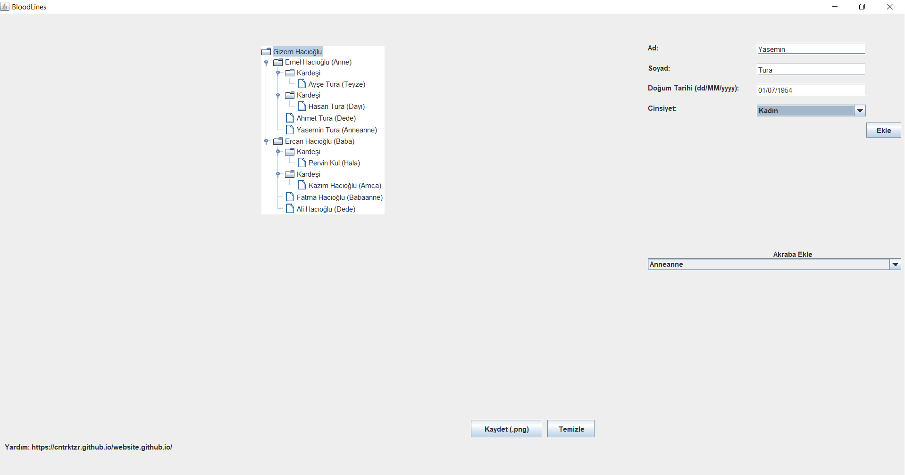

<h1>BloodLines</h1>
<h6>SE-302 Family Tree Application Project</h6>
<h3>BloodLines is a Family Tree Application.</h3>

[Go to BloodLines Website](https://cntrktzr.github.io/website.github.io/)

Group Members;
* Ali Alperen Derici
* Cantürk Tezer
* Gizem Hacıoğlu
* Orhun Kerem Yakut

<h3>Screenshots from the Application;</h3>
<h4>- Adding Person Screen</h4>

<h4>- Created Tree Screen</h4>

